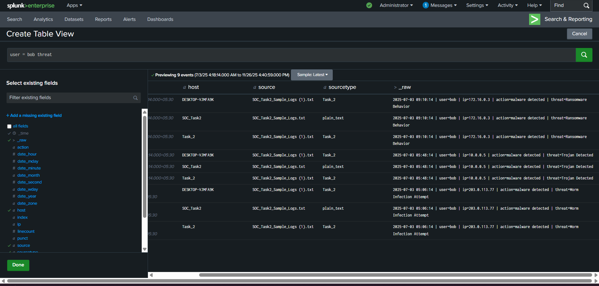
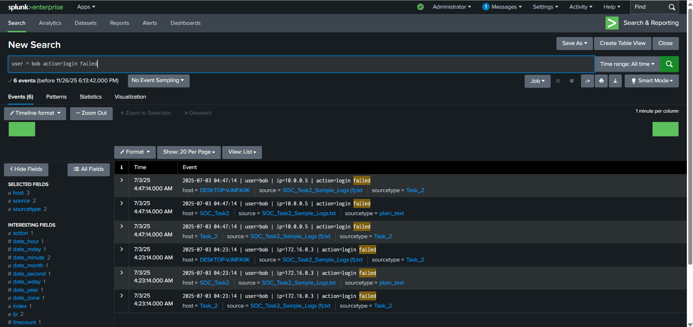
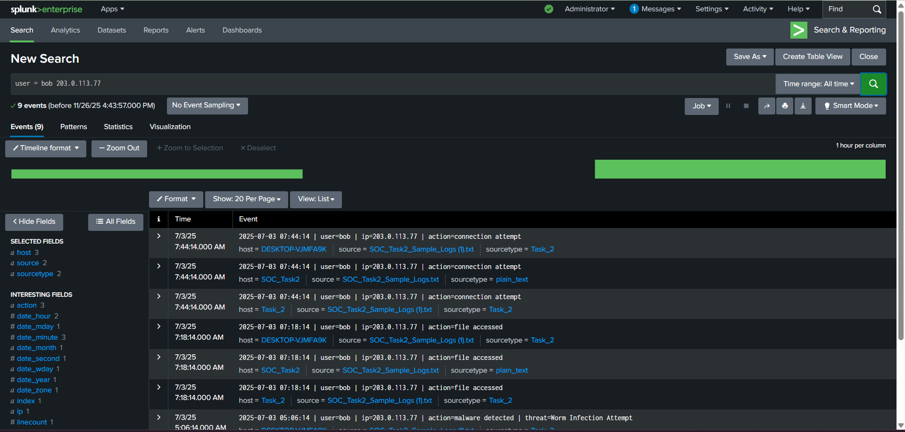
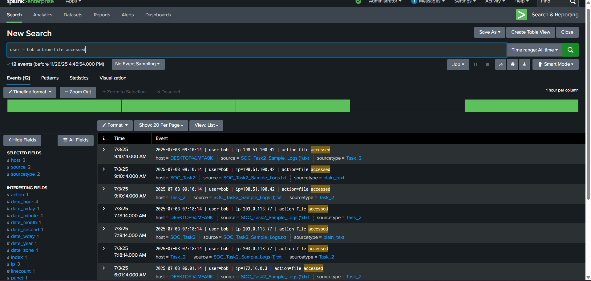
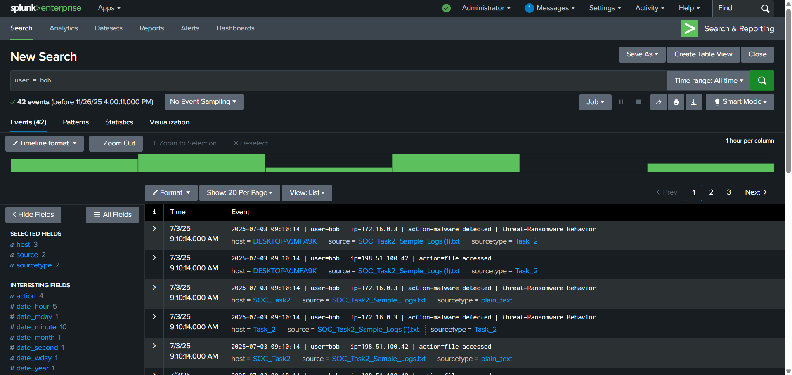

# FUTURE_CS_02
Hands-on SOC internship project analyzing user activity logs in Splunk, identifying ransomware, Trojan, and failed login patterns, and documenting the incident with professional reporting.
# 🚨 FUTURE_CS_02 – Security Operations Center (SOC) Monitoring & Incident Response

## 📖 Overview
As part of my cybersecurity internship with **Future Interns**, Task 2 focused on real-world **Security Operations Center (SOC)** workflows.  
Using **Splunk** as the SIEM platform, I performed log ingestion, threat detection, and incident investigation based on simulated enterprise security logs.

This task simulated how SOC analysts monitor suspicious activities, detect malware, investigate compromised accounts, and produce incident response documentation.

---

## ✅ Key Highlights
- Successfully onboarded and indexed `SOC_Task2_Sample_Logs` [📄`preview`](screenshots/SOC_Task2_Sample_Logss.txt) into Splunk.
- Investigated abnormal patterns for **user = bob**, including malware events and login anomalies. [📄`preview`](screenshots/user_bob_splunk.txt)
- Detected multiple high-severity alerts such as ransomware behavior, worm attempts, and Trojan activity.
- Correlated authentication failures, file access logs, and suspicious IP connections.
- Drafted a detailed **Incident Response Report** with timeline, IOCs, root cause analysis & mitigation steps.

---

## 🎯 Skills Gained
- SOC monitoring & alert triage  
- SIEM usage (Splunk Search & Reporting)  
- SPL (Search Processing Language) querying  
- Threat detection (malware, brute force, privilege misuse)  
- Incident analysis & documentation  
- Log-based investigation methodology  

---

## 🛠️ Tools Used
- **Splunk Enterprise** – SIEM platform for log analysis  
- **Sample Log Dataset** – Authentication, malware, and network events  
- **Windows 11 Environment** – For setup & analysis  
- **Markdown / PDF** – Incident reporting  

---

## 📊 Key Threats Identified
- Multiple **failed logins** indicating possible brute-force activity  
- **Trojan Detected** from internal host  
- **Worm Infection Attempt** from external IP (203.0.113.77)  
- **Ransomware Behavior Detected** (critical severity)  
- Suspicious **file access events** from multiple IPs  
- Login success immediately after repeated failures (credential compromise)

---

## 📸 Screenshots
Screenshots included in the repository:  
- Malware detection events
-  
- Failed login spikes
-    
- Suspicious IP connections
-   
- File access correlation
-    
- Incident timeline
- 
- Multiple Connection attempts
- 

---

## 📝 Deliverables
### 🛡️ SOC Incident Response Report  
📄 **[Click here to view/download Incident_Report.pdf](screenshots/FUTURE_CS_02.pdf)**  
Contains:  
- Timeline of events  
- Indicators of Compromise (IOCs)  
- Malware detection summary  
- Severity assessment  
- Root cause analysis  
- Recommended mitigation steps   
- **Alert Classification Table**  
- **Screenshots** folder containing Splunk evidence  
- **GitHub Documentation (README.md)** for portfolio showcase  

---

## 🙏 Acknowledgement
Special thanks to **Future Interns** for providing this hands-on SOC simulation experience, helping strengthen my cybersecurity fundamentals and incident analysis skills.

